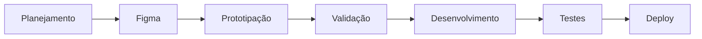

# 🦷 Smile Sync

### CRM inteligente para gestão de clínicas odontológicas

O **Smile Sync** é uma plataforma de CRM desenvolvida para centralizar, organizar e otimizar a operação de clínicas odontológicas.

A proposta do sistema é reunir em um único ambiente informações sobre pacientes, agenda, atendimentos, oportunidades comerciais e indicadores da clínica, reduzindo processos manuais e proporcionando maior controle sobre a operação.

> **Mais organização. Mais previsibilidade. Mais eficiência para clínicas odontológicas.**

---

## 📌 Sobre o projeto

Clínicas odontológicas lidam diariamente com diferentes processos: novos pacientes, agendamentos, confirmações, cancelamentos, retornos, tratamentos, follow-ups e acompanhamento de resultados.

Quando essas informações ficam distribuídas entre WhatsApp, planilhas, agendas e sistemas diferentes, a gestão se torna mais complexa.

O **Smile Sync** nasce com o objetivo de simplificar esse processo.

Nossa proposta é desenvolver uma plataforma capaz de conectar as principais áreas da clínica e transformar informações dispersas em uma operação organizada, visual e orientada por dados.

---

## 🎯 Objetivo

O Smile Sync tem como principal objetivo ajudar clínicas odontológicas a:

- Centralizar informações dos pacientes;
- Organizar leads e oportunidades;
- Melhorar o controle da agenda;
- Acompanhar o relacionamento com cada paciente;
- Reduzir esquecimentos e falhas operacionais;
- Melhorar o acompanhamento de retornos e follow-ups;
- Visualizar indicadores importantes da clínica;
- Automatizar processos repetitivos;
- Aumentar a previsibilidade da operação;
- Apoiar decisões através de dados.

---

## 🚀 Principais funcionalidades

### 👥 Gestão de pacientes

Cadastro e organização das principais informações relacionadas aos pacientes da clínica.

Permite manter um histórico centralizado e facilitar o acompanhamento de cada relacionamento.

---

### 📅 Agenda

Visualização e gerenciamento dos atendimentos da clínica.

O objetivo é proporcionar maior controle sobre:

- Consultas;
- Avaliações;
- Retornos;
- Cancelamentos;
- Reagendamentos;
- Disponibilidade da agenda.

---

### 📊 Dashboard

Painel central para acompanhamento dos principais indicadores da operação.

O dashboard poderá apresentar informações como:

- Número de pacientes;
- Novos leads;
- Consultas agendadas;
- Cancelamentos;
- Conversões;
- Retornos;
- Desempenho comercial;
- Indicadores operacionais.

---

### 🎯 Pipeline de pacientes

Visualização da jornada do paciente através de etapas organizadas em formato de funil ou Kanban.

Exemplo:

`Novo Lead → Contato Realizado → Avaliação Agendada → Avaliação Realizada → Tratamento → Retorno`

Isso permite que a equipe saiba rapidamente em qual etapa cada paciente se encontra e qual deve ser a próxima ação.

---

### 🔄 Follow-ups

Organização dos contatos que precisam ser realizados com pacientes e potenciais pacientes.

A funcionalidade busca evitar que oportunidades sejam esquecidas e possibilitar um acompanhamento comercial mais estruturado.

---

### 🔔 Lembretes e tarefas

Criação de tarefas relacionadas à rotina da clínica, permitindo que a equipe acompanhe atividades pendentes e responsáveis por cada ação.

---

### ⚙️ Automação

O Smile Sync também busca incorporar automações para reduzir atividades repetitivas dentro da operação.

Entre as possibilidades estão:

- Lembretes de consultas;
- Confirmações de agendamento;
- Follow-ups;
- Organização automática de informações;
- Atualização de status;
- Notificações internas;
- Fluxos de relacionamento com pacientes.

---

## 🤖 Inteligência Artificial

A Inteligência Artificial faz parte da visão de evolução do Smile Sync.

Nossa intenção é explorar recursos de IA capazes de apoiar a clínica em tarefas como:

- Análise de informações;
- Sugestão de próximas ações;
- Organização de dados;
- Apoio ao atendimento;
- Geração de mensagens;
- Identificação de pacientes que precisam de acompanhamento;
- Automação de atividades operacionais.

A IA será utilizada como ferramenta de apoio à equipe, buscando aumentar produtividade e eficiência.

---

## 🧩 Visão do sistema

O Smile Sync está sendo pensado como um ecossistema dividido em diferentes módulos:

```text
Smile Sync
│
├── Dashboard
│
├── Pacientes
│
├── Agenda
│
├── Pipeline
│
├── Follow-ups
│
├── Tarefas
│
├── Relatórios
│
├── Automações
│
└── Configurações
```

---

## 🎨 UI/UX e prototipação

A interface do Smile Sync está sendo planejada inicialmente no **Figma**.

Durante essa etapa serão definidos:

- Identidade visual;
- Estrutura das páginas;
- Componentes;
- Fluxos de navegação;
- Experiência do usuário;
- Organização das informações;
- Protótipo navegável.

Após a validação do protótipo, as telas servirão como referência para o desenvolvimento da aplicação.

---

## 🛠️ Tecnologias

O projeto encontra-se em desenvolvimento.

As tecnologias utilizadas serão documentadas conforme a arquitetura do sistema for sendo definida.

```text
Frontend     → Em definição
Backend      → Em definição
Banco de Dados → Em definição
Design       → Figma
Versionamento → Git + GitHub
```

---

## 🔄 Fluxo de desenvolvimento

Estamos utilizando uma metodologia organizada por etapas:



---

## 📋 Organização do projeto

As atividades da equipe são organizadas através de um quadro **Kanban**, permitindo acompanhar:

- Backlog;
- Planejamento;
- Tarefas pendentes;
- Atividades em andamento;
- Revisões;
- Tarefas concluídas.

Cada atividade deve possuir:

**Responsável + descrição + prazo + status.**

---

## 👨‍💻 Equipe

O Smile Sync é desenvolvido de forma colaborativa pela equipe responsável pelo projeto.

Cada integrante será responsável por diferentes áreas, incluindo:

- Planejamento;
- UI/UX;
- Desenvolvimento;
- Banco de dados;
- Documentação;
- Testes;
- Apresentação.

---

## 🌱 Status do projeto

> 🚧 **Em desenvolvimento**

Atualmente estamos trabalhando na etapa de:

**Planejamento → UI/UX → Prototipação no Figma**

As próximas etapas envolverão a definição da arquitetura e o início do desenvolvimento do MVP.

---

## 🗺️ Roadmap

### Fase 01 — Planejamento
- [x] Definição da ideia
- [x] Definição do público
- [x] Estrutura inicial do projeto
- [ ] Divisão de responsabilidades da equipe

### Fase 02 — UI/UX
- [ ] Arquitetura das telas
- [ ] Design System
- [ ] Protótipo no Figma
- [ ] Fluxo de navegação
- [ ] Validação do protótipo

### Fase 03 — Desenvolvimento
- [ ] Estrutura do projeto
- [ ] Banco de dados
- [ ] Autenticação
- [ ] Dashboard
- [ ] Gestão de pacientes
- [ ] Agenda
- [ ] Pipeline
- [ ] Follow-ups

### Fase 04 — Inteligência e automações
- [ ] Automações
- [ ] Notificações
- [ ] Integrações
- [ ] Recursos de IA

### Fase 05 — Finalização
- [ ] Testes
- [ ] Correções
- [ ] Documentação
- [ ] Deploy
- [ ] Apresentação final

---

## 💡 Nossa visão

O Smile Sync não pretende ser apenas um sistema para armazenar informações.

A visão do projeto é desenvolver uma ferramenta capaz de transformar a maneira como clínicas odontológicas organizam sua operação.

Queremos conectar:

**Pacientes + Agenda + Comercial + Gestão + Automação + Inteligência**

em uma única plataforma.

---

<div align="center">

# 🦷 Smile Sync

### Tecnologia que conecta clínicas, equipes e pacientes.

**CRM • Automação • Gestão • Inteligência**

</div>
